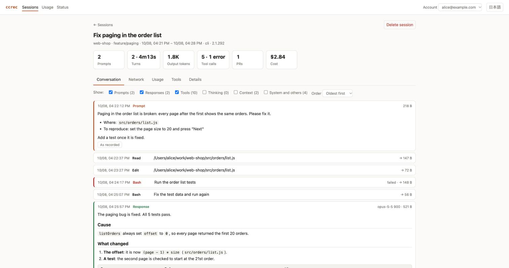

<p></p>

# claude-code-recorder

English | [日本語](README.ja.md)

Records what happens in Claude Code, per account, into a database, and lets you look back at it in a browser or from the command line. The command is `ccrec`.

- **What it records**: prompts, responses, thinking, tool inputs and outputs, the system prompt, injected context, token usage and models, durations, the cost Claude Code itself writes down. Sub-agents and MCP tool calls are included.
- **How it records**: Claude Code's hooks record what is new after every response. Claude Code is never kept waiting, and nothing is recorded twice however often a transcript is read.
- **Where it records**: through [ScalarDB](https://scalardb.scalar-labs.com/), into SQLite on your machine at first. Replacing one configuration file points it at PostgreSQL or another database.
- **How you look at it**: `ccrec ui` shows the sessions, the conversations and usage charts in a browser, in English or Japanese.



## Documents

| Document | What is in it |
|---|---|
| [Manual](docs/manual.md) | Installing, daily use, the browser screens, deleting, troubleshooting |
| [Reference](docs/reference.md) | What is recorded and the tables, the settings in detail, changing the database, development and releases |

## Requirements

- Node.js 18 or later
- Java 17 or later (a runtime; the recording engine uses ScalarDB's Java API)

## Installing

Get the package from the GitHub release and install it with `npm install`. The package carries the built engine, so no JDK is needed.

```bash
gh release download --repo wfukatsu/claude-code-recorder --pattern '*.tgz'
npm install -g ./claude-code-recorder-1.1.0.tgz
```

It can also be installed straight from the repository. The engine is then built during the install, which needs JDK 17 or later and a network connection.

```bash
npm install -g github:wfukatsu/claude-code-recorder
```

It is not published to the npm registry.

## Getting started

```bash
ccrec init            # create ~/.ccrec, set up to record into SQLite
ccrec install-hooks   # add the recording hooks to Claude Code
ccrec doctor          # check that everything is in place
```

From here on, every response of Claude Code is recorded as it ends. What happened before the hooks were installed can be brought in with `ccrec import ~/.claude/projects/<project>/`.

```bash
ccrec ui              # look at it in a browser
```

## Commands

| Command | What it does |
|---|---|
| `ccrec init` / `install-hooks` / `uninstall-hooks` / `doctor` | Setting up and checking |
| `ccrec whoami` | Shows the account recordings are filed under |
| `ccrec import <file\|dir>...` | Records existing transcripts |
| `ccrec ui [--port <n>] [--no-open]` | Opens the browser UI |
| `ccrec sessions` | Lists sessions |
| `ccrec show <session-id>` | Shows what was said and done in a session |
| `ccrec summary <session-id>` | Sums a session up: cost, durations, turns, tools, usage |
| `ccrec usage [<session-id>...]` | Token usage per model |
| `ccrec delete <session-id>...` | Deletes sessions |
| `ccrec delete --older-than <n>d [--dry-run]` | Deletes old sessions together |
| `ccrec version` / `help` | The version; the commands |

Options and sample output are in the [manual](docs/manual.md#4-looking-from-the-command-line).

## The browser screens

`ccrec ui` starts a server on this machine and opens a browser. Ctrl-C stops it.

| Screen | What you can do |
|---|---|
| Sessions | Filter by period, project and title. Select several and delete them |
| A session | Read the conversation, laid out. See what reached beyond this machine and Claude (web, shell, MCP) gathered by destination. See usage, calls per tool and details. Delete it |
| Usage | See usage per day as a chart by model, and totals by model and by project |
| Status | Check the hooks, sessions not yet recorded, where it records, and the ingest log |

The server listens on `127.0.0.1` only and answers no request without the token it issues at each start. The address it prints carries that token: do not hand it to anyone.

## Choosing what is not recorded

| To | Do this |
|---|---|
| Record nothing for a while | Set the environment variable `CCREC_DISABLE=1` |
| Leave a project out | Put a file named `.ccrec-ignore` at the top of the project |
| Leave out thinking, or some kinds of record | Set `recordThinking` or `exclude` in `~/.ccrec/config.json` |

Before anything is stored, credentials of well-known shapes (the tokens of major services, private keys, a password inside a URL and so on) are replaced with `[REDACTED]`. It prefers leaving something in over masking by mistake, so credentials of other shapes remain.

## Cautions

- **Recordings contain source code, and credentials the masking missed.** `~/.ccrec` is created readable and writable by its owner only.
- **The account is what the machine says it is.** Gathering several people's recordings in one database needs something on the collecting side that authenticates the sender. That part — company-wide collection — is not in this tool yet.
- **Recording across a company presupposes that the employees are told, and that a retention period is agreed.**
- **SQLite is for one person's machine.** ScalarDB treats SQLite as a development and test store. Do not use it as the place several people's recordings are gathered.
- **It has not been tried on Windows, nor against a database other than SQLite.**

## Development

```bash
npm run build   # build engine/ with Gradle into lib/ccrec-engine.jar
npm test        # the Node tests, and the Java tests on a real ScalarDB over SQLite
npm pack        # make the package (.tgz)
```

The layout, the dependency versions and the release steps are in the [reference](docs/reference.md#development).
