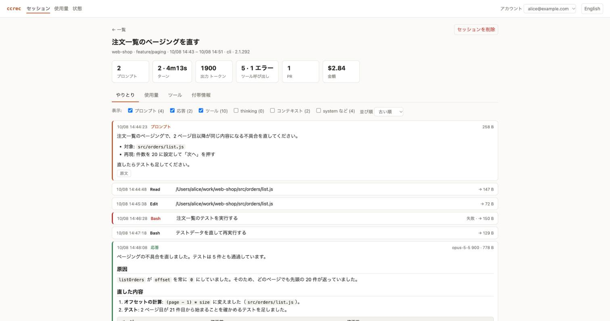

# claude-code-recorder

Claude Code でのやりとりを、アカウント単位でデータベースに記録し、ブラウザやコマンドで見返せるようにするツールです。コマンド名は `ccrec` です。

- **記録するもの**: プロンプト、応答、thinking、ツールの入出力、システムプロンプト、注入されたコンテキスト、トークン使用量とモデル、所要時間、Claude Code が書き残した金額など。サブエージェントや MCP のツール呼び出しも含みます。
- **記録のしかた**: Claude Code のフックが応答のたびに差分を記録します。Claude Code を待たせず、何度取り込んでも重複しません。
- **保存先**: [ScalarDB](https://scalardb.scalar-labs.com/) 経由で、最初は端末内の SQLite です。設定ファイルの差し替えで PostgreSQL などに切り替えられます。
- **見かた**: `ccrec ui` でブラウザに一覧、やりとり、使用量のグラフを表示します。日本語と英語を切り替えられます。



## ドキュメント

| 文書 | 内容 |
|---|---|
| [操作マニュアル](docs/manual.md) | インストール、日々の使い方、ブラウザの画面、削除、困ったときの対処 |
| [リファレンス](docs/reference.md) | 記録する内容とテーブル、設定の詳細、保存先の切り替え、開発とリリース |

## 必要なもの

- Node.js 18 以降
- Java 17 以降（実行環境。記録エンジンが ScalarDB の Java API を使うため）

## インストール

配布パッケージを GitHub のリリースから取得して、`npm install` で入れます。パッケージにはビルド済みのエンジンが入っているので、JDK は要りません。

```bash
gh release download --repo wfukatsu/claude-code-recorder --pattern '*.tgz'
npm install -g ./claude-code-recorder-0.2.0.tgz
```

リポジトリから直接入れることもできます。この場合はインストール時にエンジンをビルドするので、JDK 17 以降とネットワーク接続が必要です。

```bash
npm install -g github:wfukatsu/claude-code-recorder
```

npm のレジストリには公開していません。

## はじめかた

```bash
ccrec init            # ~/.ccrec を作る（SQLite に記録する設定つき）
ccrec install-hooks   # Claude Code に記録用のフックを追加する
ccrec doctor          # 動く状態かを確かめる
```

これ以降、Claude Code が応答を終えるたびに自動で記録されます。フックを入れる前のやりとりは、`ccrec import ~/.claude/projects/<プロジェクト>/` で取り込めます。

```bash
ccrec ui              # ブラウザで見る
```

## コマンド

| コマンド | 役割 |
|---|---|
| `ccrec init` / `install-hooks` / `uninstall-hooks` / `doctor` | 準備と確認 |
| `ccrec whoami` | 記録が付くアカウントを表示する |
| `ccrec import <ファイル\|ディレクトリ>...` | 既存のトランスクリプトを取り込む |
| `ccrec ui [--port <n>] [--no-open]` | ブラウザで見る |
| `ccrec sessions` | セッションの一覧 |
| `ccrec show <セッション ID>` | やりとりの中身 |
| `ccrec summary <セッション ID>` | セッションの要約（金額、所要時間、ターン、ツール、使用量） |
| `ccrec usage [<セッション ID>...]` | モデル別のトークン使用量 |
| `ccrec delete <セッション ID>...` | セッションを消す |
| `ccrec delete --older-than <n>d [--dry-run]` | 古いセッションをまとめて消す |
| `ccrec version` / `help` | バージョン、コマンドの説明 |

オプションと出力の例は、[操作マニュアル](docs/manual.md#4-コマンドで見る) にあります。

## ブラウザの画面

`ccrec ui` はこの端末でサーバーを起動し、ブラウザを開きます。Ctrl-C で止まります。

| 画面 | できること |
|---|---|
| セッション一覧 | 期間、プロジェクト、タイトルで絞り込む。複数選んで削除する |
| セッション詳細 | 整形されたやりとりを読む。使用量、ツール別の回数、付帯情報を見る。削除する |
| 使用量 | 日ごとの使用量をモデル別のグラフで見る。モデル別、プロジェクト別の合計を見る |
| 状態 | フック、未記録のセッション、保存先、取り込みログを確かめる |

サーバーは `127.0.0.1` だけで待ち受け、起動のたびに変わるトークンの無い要求には応えません。表示されるアドレスにはトークンが入っているので、人に渡さないでください。

## 記録しない範囲を決める

| やりたいこと | 方法 |
|---|---|
| 一時的に何も記録しない | 環境変数 `CCREC_DISABLE=1` |
| あるプロジェクトを記録しない | プロジェクトの直下に `.ccrec-ignore` を置く |
| thinking や特定の種類を記録しない | `~/.ccrec/config.json` の `recordThinking`、`exclude` |

記録する前に、既知の形式の認証情報（主なサービスのトークン、秘密鍵、URL の中のパスワードなど）を `[REDACTED]` に置き換えます。誤って伏せないことを優先しているので、それ以外の形のものは残ります。

## 注意

- **記録には、ソースコードや伏せきれなかった認証情報が入ります。** `~/.ccrec` は所有者だけが読み書きできる権限で作られます。
- **アカウントは端末側の自己申告です。** 複数人の記録を 1 つのデータベースに集める場合は、収集側で送信者を認証する仕組みが別に要ります。その仕組み（全社収集）は、このツールにはまだありません。
- **全社で記録する場合は、従業員への周知と保持期間の取り決めが前提です。**
- **SQLite は個人の端末向けです。** ScalarDB は SQLite を開発・テスト用途としています。複数人の集約先には使わないでください。
- **Windows と、SQLite 以外のデータベースでは動作を確認していません。**

## 開発

```bash
npm run build   # engine/ を Gradle でビルドし lib/ccrec-engine.jar を作る
npm test        # Node のテストと、SQLite 上の実 ScalarDB を使う Java のテスト
npm pack        # 配布パッケージ（.tgz）を作る
```

構成、依存バージョン、リリースの手順は [リファレンス](docs/reference.md#開発) にあります。
