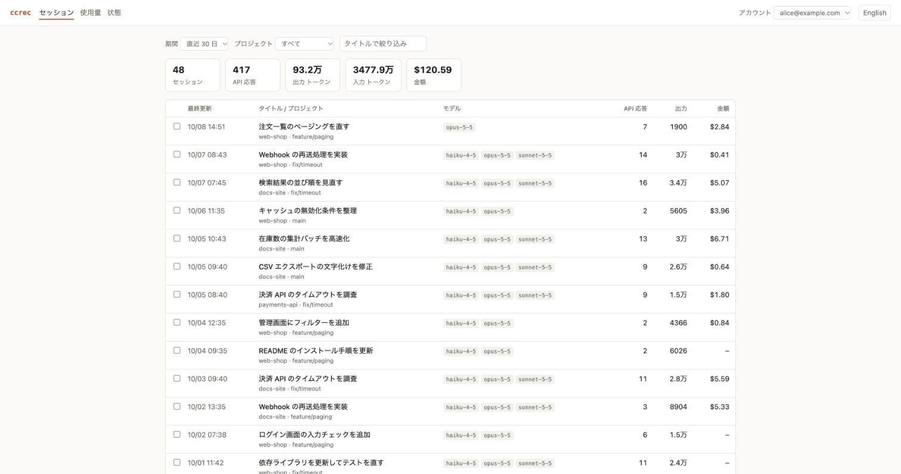
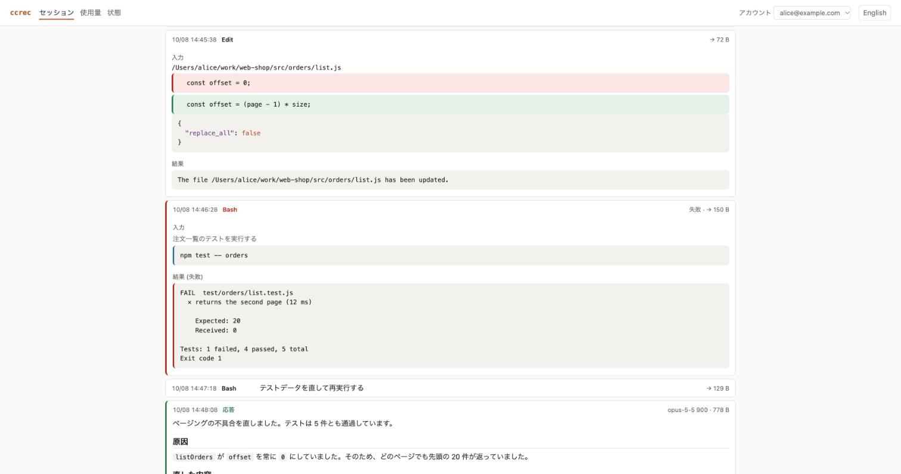
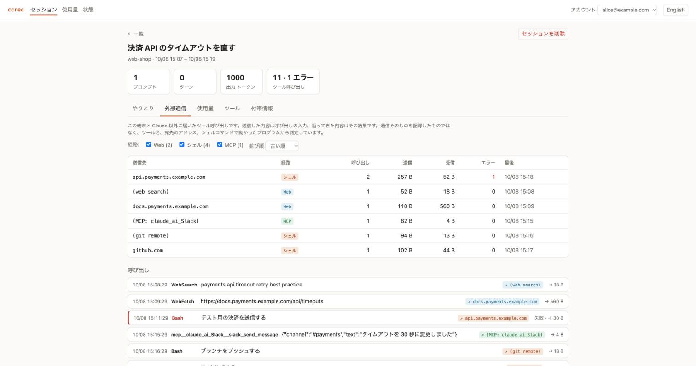
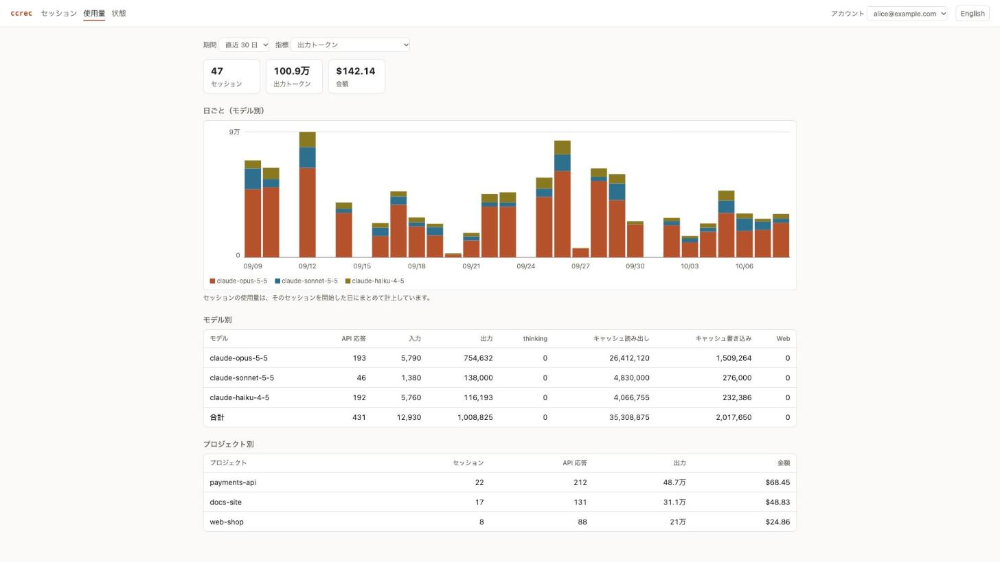
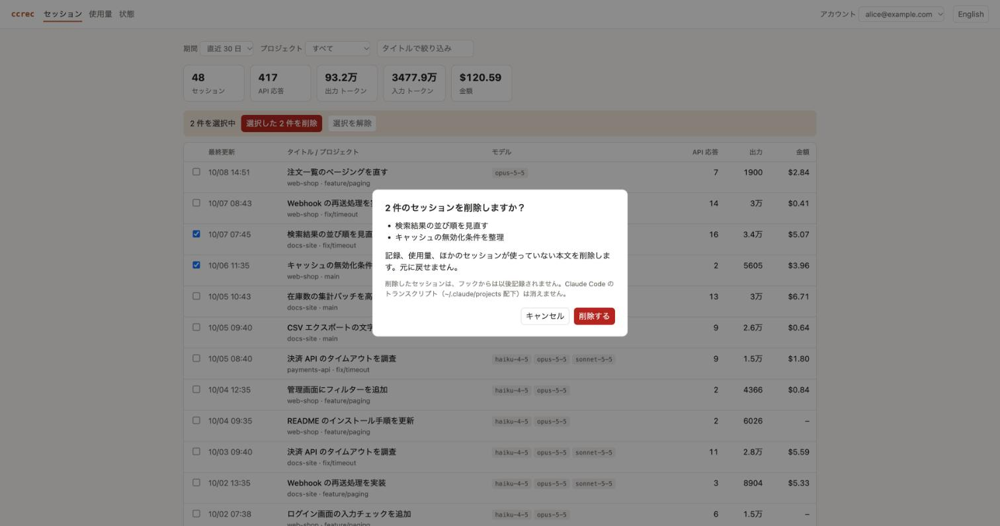

# 操作マニュアル

[English](manual.md) | 日本語

`ccrec` のインストールから、日々の使い方、ブラウザでの閲覧、記録の削除、困ったときの対処までを説明します。何がどう記録されるかの詳細は [リファレンス](reference.ja.md) にあります。

画面とコマンドの例は、説明用に作ったデータのものです。

## 目次

1. [準備する](#1-準備する)
2. [記録する](#2-記録する)
3. [ブラウザで見る](#3-ブラウザで見る)
4. [コマンドで見る](#4-コマンドで見る)
5. [記録を消す](#5-記録を消す)
6. [記録しない範囲を決める](#6-記録しない範囲を決める)
7. [保存先を変える](#7-保存先を変える)
8. [更新する、やめる](#8-更新するやめる)
9. [困ったとき](#9-困ったとき)
10. [コマンドとファイルの一覧](#10-コマンドとファイルの一覧)

## 1. 準備する

### 必要なもの

| 必要なもの | バージョン | 確認のしかた |
|---|---|---|
| Node.js | 18 以降 | `node --version` |
| Java（実行環境） | 17 以降 | `java -version` |
| Claude Code | フックが使える版 | `claude --version` |

Java は実行できれば足ります。配布パッケージにはビルド済みのエンジンが入っているので、JDK やビルドツールは要りません。

### インストールする

配布パッケージ（`.tgz`）を GitHub のリリースから取得して、`npm install` で入れます。

```bash
gh release download --repo wfukatsu/claude-code-recorder --pattern '*.tgz'
npm install -g ./claude-code-recorder-1.0.0.tgz
ccrec version
```

`ccrec version` がバージョンを表示すれば、インストールできています。

リポジトリから直接入れることもできます。この場合はインストール時にエンジンをビルドするので、JDK 17 以降と、依存ライブラリを取得するためのネットワーク接続が必要です。

```bash
npm install -g github:wfukatsu/claude-code-recorder
```

### 初期設定をする

```bash
ccrec init            # ~/.ccrec を作る（SQLite に記録する設定つき）
ccrec install-hooks   # Claude Code に記録用のフックを追加する
ccrec doctor          # 動く状態かを確かめる
```

`ccrec install-hooks` は `~/.claude/settings.json` に 4 つのフックを足します。ほかの設定には触れません。変更前のファイルは、最初の 1 回だけ `~/.claude/settings.json.ccrec-bak` に残します。

特定のプロジェクトだけで記録したい場合は、そのプロジェクトのディレクトリで `ccrec install-hooks --project` を実行します。`./.claude/settings.json` にフックが入ります。

### 動く状態かを確かめる

`ccrec doctor` の全部の行が `ok` なら準備完了です。

```
ok    Java 17 or later  (found 17)
ok    engine JAR  (…/claude-code-recorder/lib/ccrec-engine.jar)
ok    ScalarDB configuration  (/Users/alice/.ccrec/database.properties)
ok    hooks installed  (/Users/alice/.claude/settings.json)
ok    queued sessions recorded  (none waiting)
ok    queue entries readable  (0 unreadable in /Users/alice/.ccrec/spool)
account  emp-alice  via env
```

最後の行は、記録がどのアカウントに付くかを示します。`FAIL` が出た場合は [困ったとき](#9-困ったとき) を見てください。

## 2. 記録する

### 自動で記録する

フックを入れた後は、何もしなくても記録されます。Claude Code が応答を終えるたびに、前回からの差分だけがデータベースに入ります。

- フックがすることは、記録の依頼をキューに置くことだけです。データベースへの書き込みは別のプロセスが行うので、Claude Code は待たされません。
- 記録が走らなかった場合（パソコンを閉じた、Java が見つからなかったなど）は、次に Claude Code が応答したときにまとめて記録されます。
- すでに動いている Claude Code のセッションにも、フックを入れた直後の応答から効きます。

### 過去のやりとりを取り込む

フックを入れる前のやりとりは、Claude Code が残しているトランスクリプトから取り込めます。

```bash
ccrec import ~/.claude/projects/<プロジェクトのディレクトリ>/
ccrec import ~/.claude/projects/<プロジェクトのディレクトリ>/<セッション ID>.jsonl
```

- ディレクトリを指定すると、その中の `*.jsonl` をすべて取り込みます。
- 何度実行しても重複しません。取り込み済みの行は読み飛ばします。
- 取り込んだ記録は、実行した人のアカウントに付きます。すでに記録のあるセッションは、最初に記録したアカウントのままです。

### どのアカウントに記録されるか

```bash
ccrec whoami
```

アカウントは次の順で決まります。

1. 環境変数 `CCREC_ACCOUNT_ID`（管理者が配る社員 ID など）
2. Claude Code にログインしているアカウント
3. OS のユーザー名（`local-<ユーザー名>`）

## 3. ブラウザで見る

### 起動する、止める

```bash
ccrec ui
```

サーバーが起動し、ブラウザが開きます。開かない場合は、ターミナルに表示されるアドレスを開いてください。

```
ccrec ui: http://127.0.0.1:4127/?token=…
Ctrl-C stops it.
```

- 止めるには、起動したターミナルで Ctrl-C を押します。
- アドレスの `token=…` は、起動のたびに変わる合言葉です。このアドレスを人に渡さないでください。
- 待ち受けるのはこの端末（`127.0.0.1`）だけです。ほかの端末からは見られません。
- ポートを変えるには `ccrec ui --port 4200` のようにします。ブラウザを開かずアドレスだけを表示するには `--no-open` を付けます。

### 画面に共通の操作

画面の上部に、次のものが並びます。

- **セッション / 使用量 / 状態**: 画面を切り替えます。
- **アカウント**: データベースに記録のあるアカウントを切り替えます。最初は、起動した人のアカウントが選ばれています。
- **English / 日本語**: 表示の言語を切り替えます。

選んだ言語、アカウント、期間、並び順は、ブラウザが覚えています。

### セッション一覧



最初に開く画面です。最後に動きのあったセッションが上に来ます。

- **絞り込み**: 期間（直近 7 / 30 / 90 日、すべて）、プロジェクト、タイトルの一部で絞り込めます。
- **合計**: 表示しているセッションの件数、API 応答数、出力と入力のトークン数、金額が上に出ます。
- **列**: 最終更新、タイトルとプロジェクト（ブランチ）、使ったモデル、API 応答数、出力トークン数、金額です。
- **開く**: タイトルを押すと、そのセッションの詳細に移ります。

金額は、Claude Code 自身がそのセッションについて書き残した値です。書き残されていないセッションは「–」になります。

### セッション詳細


上から、タイトル、プロジェクトと時刻、主な数字（プロンプト数、ターン数と時間、出力トークン数、ツール呼び出しとエラー、PR、金額）、5 つのタブが並びます。

#### 「やりとり」タブ

やりとりを 1 件 1 行で表示します。

- **並び順**: 最初は新しい順です。長いセッションでも、最新のやりとりがすぐ見られます。会話として上から読みたいときは、「並び順」を「古い順」にします。
- **表示する種類**: チェックボックスで、プロンプト、応答、ツール、thinking、コンテキスト、system などを出し入れします。かっこ内は件数です。最初はプロンプト、応答、ツールだけを表示します。
- **エージェント**: サブエージェントを使ったセッションでは、エージェントごとに絞り込めます。
- **続きを読み込む**: 一度に 500 件まで表示します。それより多い場合は、下のボタンで続きを読み込みます。

プロンプトと応答は、最初から開いた状態で表示します。

- Markdown（見出し、箇条書き、表、コード）を整形します。
- 長い本文は 1 画面ぶんで折りたたみます。「すべて表示」で開きます。
- 「原文」を押すと、記録されたままの文字に切り替わります。

行の左の色とラベルで、種類を見分けられます。

| ラベル | 意味 | 見た目 |
|---|---|---|
| プロンプト | 人が打ったプロンプト | 左に橙の線 |
| 応答 | Claude の応答 | 左に緑の線 |
| コマンド | スラッシュコマンドの実行 | 左に青の線 |
| 通知 | バックグラウンドタスクなどの通知 | 灰色の地 |
| コマンド出力 | コマンドの出力 | 灰色の地 |
| 圧縮後の要約 | 会話を圧縮したときに Claude Code が書いた要約 | 灰色の地、最初は閉じている |

ツールの行は、押すと開きます。



- 閉じた状態では、ツール名と要点（`Bash` は説明、ファイル操作はファイルのパス）、結果の大きさが出ます。
- `Bash` は、説明とコマンド、その下に結果を表示します。
- `Edit` と `Write` は、ファイルのパス、変更前（赤）、変更後（緑）を表示します。
- 失敗した呼び出しは、左に赤い線が付き、結果に「失敗」と出ます。

やりとりの中で、この端末と Claude 以外に届いたツール呼び出しには、行の右に「↗ 送信先」の印が付きます。

#### 「外部通信」タブ



この端末と Claude 以外に届いたツール呼び出しを、1 か所にまとめたタブです。何をどこに送り、何が返ってきたかを確かめられます。

- **送信先の表**: 送信先ごとに、経路、呼び出し回数、送信と受信の大きさ、エラーの数、最後に呼び出した時刻が出ます。
- **経路で絞り込む**: 上のチェックボックスで、Web、シェル、MCP を出し入れします。
- **送信先で絞り込む**: 表の送信先を押すと、その送信先への呼び出しだけになります。もう一度押すと戻ります。
- **呼び出しの一覧**: 下に、該当する呼び出しが並びます。行を開くと、送信した内容（入力）と返ってきた内容（結果）が出ます。

経路は 3 種類です。

| 経路 | 対象 | 送信先の出かた |
|---|---|---|
| Web | `WebFetch`、`WebSearch` など、アドレスを指定するツール | アドレスのホスト名。検索は `(web search)` |
| シェル | `Bash` で動かした、通信するプログラム（`curl`、`wget`、`git push`、`gh`、`npm install`、`ssh` など） | コマンドに書かれたホスト名。書かれていなければ `(git remote)`、`(npm registry)` などの種類 |
| MCP | MCP サーバーのツール | 入力にアドレスがあればそのホスト名。なければ `(MCP: サーバー名)` |

次のものは外部通信に数えません。

- `localhost`、`127.0.0.1`、社内の IP アドレス（`10.x`、`192.168.x` など）、ドットの無いホスト名
- Claude 自身（`anthropic.com`、`claude.ai`、`claude.com`）
- この端末の中で動く MCP サーバー（ブラウザの操作など）。ただし、入力に外部のアドレスがあれば数えます

**これは通信そのものを記録したものではありません。** ツール名、アドレス、コマンドの中身から判定しています。そのため、次の点に注意してください。

- スクリプトの中から直接通信した場合（`python3 script.py` や `node app.js` が中で通信する場合）は、見つけられません。
- 通信するプログラムを動かしていれば、実際には通信しなかった場合も数えます。
- ヒアドキュメントで書き込んだファイルや、コミットメッセージに含まれるアドレスは数えません。
- MCP サーバーがこの端末の中だけで動くかどうかは、名前からは分かりません。よく使われるものは最初から端末内として扱います。それ以外で端末内のものは、`~/.ccrec/config.json` の `localMcpServers` にサーバー名を書くと、外部通信から外せます。

```json
{ "recordThinking": true, "redact": true, "localMcpServers": ["my-local-server"] }
```

#### 「使用量」タブ

モデルごとの API 応答数とトークン数です。入力、出力、thinking、キャッシュの読み出しと書き込み、Web の検索・取得回数が並びます。thinking は出力の内数です。

#### 「ツール」タブ

ツールごとの呼び出し回数とエラー回数です。MCP のツールは `mcp__<サーバー>__<ツール>` の名前で出ます。

#### 「付帯情報」タブ

セッションについて分かっていることの一覧です。起動元、Claude Code のバージョン、API とツールの所要時間、変更行数、プロンプトの出どころ、終了理由、権限モード、使ったスキルや MCP サーバー、作成した PR などです。

### 使用量



アカウントの使用量を期間で見る画面です。

- **期間と指標**: 上のセレクターで、期間（直近 7 / 30 / 90 日）と指標（出力トークン、入力トークン、API 応答数）を選びます。
- **グラフ**: 1 日 1 本の棒で、モデルごとに色を分けて積み上げます。棒にカーソルを合わせると、日付、モデル、値が出ます。
- **モデル別、プロジェクト別**: 同じ期間の合計を表で示します。プロジェクト別には金額も出ます。

セッションの使用量は、そのセッションを開始した日にまとめて計上します。日をまたいで続いたセッションは、開始日に全部が載ります。

### 状態

記録が正しく動いているかを確かめる画面です。`ccrec doctor` と同じ確認を、ブラウザで見られます。

- **確認**: フックが入っているか、未記録のセッションが無いか、読めないキューが無いかを `ok` / `FAIL` で示します。
- **環境**: バージョン、データの場所、保存先、設定の内容です。データベースのパスワードは表示しません。
- **フックが保持しているセッション**: 開いているセッションごとに、最後のイベント、取り込みを求めた時刻、最後に取り込んだ時刻、状態を示します。
- **取り込みログ**: 取り込みを起動した時刻と結果の、最新の 60 行です。

「更新」を押すと読み直します。

### 画面から削除する



- **1 件を消す**: セッション詳細の右上にある「セッションを削除」を押します。
- **まとめて消す**: 一覧で行の左のチェックボックスを付け、上に出る「選択した n 件を削除」を押します。一度に 50 件までです。

どちらも確認の画面が出ます。「削除する」を押すと消えます。**元に戻せません。** 消えるものは [記録を消す](#5-記録を消す) と同じです。

絞り込みを変えて見えなくなった行の選択は、自動で外れます。見えていないセッションが消えることはありません。

## 4. コマンドで見る

### セッションの一覧

```bash
ccrec sessions                  # 自分のセッション（新しい順、30 件）
ccrec sessions --limit 100
ccrec sessions --account emp-bob
ccrec sessions --day 20261007   # 組織の、その日に始まったセッション
```

```
2026-10-08 14:43  a1a1a1a1-0000-4000-8000-999999999999  emp-alice  claude-opus-5-5  注文一覧のページングを直す
2026-10-07 08:35  a1a1a1a1-0000-4000-8000-000000000002  emp-alice  claude-haiku-4-5  Webhook の再送処理を実装
```

左から、開始時刻、セッション ID、アカウント、最後に使ったモデル、タイトルです。ほかのコマンドには、このセッション ID を渡します。`--day` の日付は UTC です。

### やりとりの中身

```bash
ccrec show <セッション ID>                          # 各レコードの先頭を表示
ccrec show <セッション ID> --kind user_prompt,assistant_text
ccrec show <セッション ID> --full                   # 本文を全部表示
ccrec show <セッション ID> --json
```

```
--- [main] user_prompt  line 2.0  2026-10-08 14:44  258 bytes
注文一覧のページングで、2 ページ目以降が同じ内容になる不具合を直してください。
--- [main] tool_use Read  line 3.0  2026-10-08 14:44  61 bytes  claude-opus-5-5  in=24 out=180 cache read=48000 write=1500
```

`--kind` に指定できる種類は、`user_prompt`、`assistant_text`、`thinking`、`tool_use`、`tool_result`、`system_prompt`、`tool_definitions`、`context`、`system`、`cost`、`pr_link`、`mcp_meta` などです。

### セッションの要約

```bash
ccrec summary <セッション ID>
ccrec summary <セッション ID> --json
```

```
title                 注文一覧のページングを直す
cost usd              $2.84 (as Claude Code last wrote it down)
api duration          3m06s
lines added           38
prompts               2
turns                 2
turn duration         4m13s
stop reasons          end_turn 2, tool_use 5
pull requests         https://github.com/example/web-shop/pull/128

tool   calls  errors
Bash       3       1
Edit       1       0
Read       1       0
```

（一部の行を省いています。）この下に、モデル別の使用量の表が続きます。

### 使用量

```bash
ccrec usage                     # 自分の直近 30 セッションの合計
ccrec usage <セッション ID>...   # そのセッションの分
ccrec usage --day 20261007      # 組織の、その日のセッションの分
ccrec usage --json
```

```
account    model              messages        input       output     thinking     cache read    cache write    web
emp-alice  claude-haiku-4-5         20          600        9,284            0        324,940         18,568      0
emp-alice  claude-opus-5-5          27          768       78,166          840      3,005,310        163,032      0
emp-alice  claude-sonnet-5-5         5          150       15,000            0        525,000         30,000      0
total      5 sessions               52        1,518      102,450          840      3,855,250        211,600      0
```

`messages` は API 応答の数、`web` は Web の検索と取得の回数の合計です。

## 5. 記録を消す

### セッションを指定して消す

```bash
ccrec delete <セッション ID>...
```

### 古いものをまとめて消す

```bash
ccrec delete --older-than 90d --dry-run   # 対象を表示するだけ。何も消さない
ccrec delete --older-than 90d             # 90 日以上動きのないセッションを消す
ccrec delete --before 2026-07-01          # その日の 0 時より前に動きが止まったものを消す
```

```
2026-09-09 14:45  a1a1a1a1-0000-4000-8000-000000000046  依存ライブラリを更新してテストを直す
2026-09-09 08:40  a1a1a1a1-0000-4000-8000-000000000047  ログイン画面の入力チェックを追加
10 sessions of emp-alice last active before 2026-09-13 15:33; nothing deleted
```

先に `--dry-run` で対象を確かめてから、外して実行することを勧めます。対象は自分のアカウントの分です。`--account <ID>` で変えられます。

### 消えるもの、残るもの

| | |
|---|---|
| 消える | セッションの行、やりとりの記録、使用量、取り込み位置、ほかのセッションが使っていない本文 |
| 残る | ほかのセッションも使っている本文（共通のシステムプロンプトなど） |
| 残る | Claude Code のトランスクリプト（`~/.claude/projects` 配下） |

- **元に戻せません。** 確認は求められないので、セッション ID と日付をよく確かめてください。
- セッション ID を指定して消したセッションは、フックからは以後記録されません。`ccrec import` で明示的に取り込めば、最初から記録し直せます。
- SQLite のファイルは小さくなりません。空いた領域は、以後の記録に再利用されます。ファイルからも痕跡を消すには、`sqlite3 ~/.ccrec/ccrec.sqlite3 VACUUM` を実行します。
- 定期的に消す機能はありません。必要なら、`ccrec delete --older-than 90d` を cron などから実行してください。

## 6. 記録しない範囲を決める

| やりたいこと | 方法 |
|---|---|
| 一時的に何も記録しない | 環境変数 `CCREC_DISABLE=1` を設定して Claude Code を起動する |
| あるプロジェクトを記録しない | プロジェクトの直下に空のファイル `.ccrec-ignore` を置く |
| thinking を記録しない | `~/.ccrec/config.json` で `"recordThinking": false` にする |
| 特定の種類を記録しない | `~/.ccrec/config.json` の `"exclude"` に種類を書く |

`.ccrec-ignore` は、置いたディレクトリより下のどこで作業していても効きます。一度該当したセッションは、ほかのディレクトリに移っても最後まで記録されません。

`exclude` の例です。ほかのフックの実行結果を記録から外します。フックを多く入れた環境では、これが記録の半分近くを占めることがあります。

```json
{ "recordThinking": true, "redact": true, "exclude": ["context/hook_success"] }
```

設定は、次に記録するときから効きます。すでに記録した分は消えません。

### 認証情報の伏せ字

記録する前に、認証情報の形をした文字列を `[REDACTED]` に置き換えます。対象は、主なサービスのトークン、JWT、秘密鍵、URL の中のパスワード、`Authorization` ヘッダーの値、`DB_PASSWORD=…` のような代入です。

誤って伏せないことを優先しているので、これ以外の形の認証情報は残ります。**記録には、ソースコードや伏せきれなかった認証情報が入りうる**ものとして扱ってください。`~/.ccrec` は、所有者だけが読み書きできる権限で作られます。

## 7. 保存先を変える

最初の設定では、`~/.ccrec/ccrec.sqlite3`（SQLite）に記録します。`~/.ccrec/database.properties` を書き換えると、保存先が変わります。

```properties
scalar.db.storage=jdbc
scalar.db.contact_points=jdbc:postgresql://db.example.com:5432/ccrec
scalar.db.username=ccrec
scalar.db.password=********
scalar.db.transaction_manager=consensus-commit
```

- 配布パッケージで使えるのは、SQLite、PostgreSQL、MariaDB です。
- それ以外のデータベースについては、[リファレンス](reference.ja.md#データベースを切り替える) を見てください。
- 保存先を変えても、変える前の記録は移りません。

データの場所そのものを変えるには、環境変数 `CCREC_HOME` を設定します（既定は `~/.ccrec`）。

## 8. 更新する、やめる

### 新しい版に更新する

新しい配布パッケージを、同じ手順でインストールします。

```bash
npm install -g ./claude-code-recorder-<新しいバージョン>.tgz
ccrec doctor
```

- フックと記録済みのデータは、そのまま使えます。
- データベースの列やテーブルが増えた場合は、最初の実行時に自動で追加されます。
- `ccrec ui` を起動したままの場合は、止めて起動し直してください。
- 新しい版で記録する項目が増えても、すでに記録した分には付きません。付け直すには、そのセッションを消して `ccrec import` で取り込み直します。

### 記録をやめる

```bash
ccrec uninstall-hooks   # フックを外す。ほかの設定は残る
```

フックを外しても、記録済みのデータは残ります。`ccrec ui` や `ccrec sessions` で引き続き見られます。

### 完全に取り除く

```bash
ccrec uninstall-hooks
npm uninstall -g claude-code-recorder
rm -rf ~/.ccrec          # 記録したデータをすべて消す
```

## 9. 困ったとき

まず `ccrec doctor` を実行してください。`FAIL` の行ごとの対処は次のとおりです。

| `FAIL` の行 | 原因 | 対処 |
|---|---|---|
| `Java 17 or later` | Java が無い、または古い | Java 17 以降を入れる。別の場所の Java を使うなら、環境変数 `CCREC_JAVA` に `java` のパスを設定する |
| `engine JAR` | エンジンが入っていない | 配布パッケージを入れ直す |
| `ScalarDB configuration` | 初期設定をしていない | `ccrec init` を実行する |
| `hooks installed` | フックが入っていない | `ccrec install-hooks` を実行する |
| `queued sessions recorded` | 10 分以上記録されていないセッションがある | `ccrec ingest` を実行する。直らなければ、表示される `ingest.log` の内容を確かめる |
| `queue entries readable` | 壊れたキューがある | `~/.ccrec/spool/*.json.bad` を確かめ、不要なら消す |

### よくある症状

**記録されない。**

- `ccrec doctor` で `hooks installed` が `ok` かを確かめます。
- プロジェクトやその上のディレクトリに `.ccrec-ignore` が無いか、`CCREC_DISABLE=1` が設定されていないかを確かめます。
- `~/.ccrec/logs/ingest.log` に、取り込みを起動した時刻と結果が残っています。`~/.ccrec/logs/hook.err` にはフックのエラーが残ります。

**Node.js を入れ替えたら記録されなくなった。**

フックは、インストールしたときの Node.js の場所を覚えています。nvm などで Node.js のバージョンを変えた場合は、`ccrec` を入れ直してから `ccrec install-hooks` をもう一度実行してください。

**`ccrec ui` が「port 4127 is in use」と出る。**

すでに `ccrec ui` が動いているか、ほかのプログラムがそのポートを使っています。動いている方を止めるか、`ccrec ui --port 4200` のように別のポートを指定します。

**ブラウザに「Open the address that "ccrec ui" printed」と出る。**

トークンの無いアドレスを開いています。`ccrec ui` を起動し直した後は、前のアドレスは使えません。ターミナルに表示された新しいアドレスを開いてください。

**画面からの削除で「ほかの ccrec の処理が書き込み中です」と出る。**

ちょうど記録が走っています。数秒待ってから、もう一度削除してください。

**使用量や金額が空になっている。**

- 金額は、Claude Code がそのセッションについて書き残したときだけ出ます。書き残されないセッションもあります。
- 古い版で記録したセッションには、後から増えた項目が付いていません。そのセッションを消して `ccrec import` で取り込み直すと付きます。

## 10. コマンドとファイルの一覧

### コマンド

| コマンド | 役割 |
|---|---|
| `ccrec init` | `~/.ccrec` と SQLite 用の設定を作る |
| `ccrec install-hooks [--project \| --settings <ファイル>]` | 記録用のフックを追加する |
| `ccrec uninstall-hooks [--project \| --settings <ファイル>]` | フックを外す |
| `ccrec doctor` | 動く状態かを確かめる |
| `ccrec whoami` | 記録が付くアカウントを表示する |
| `ccrec import <ファイル\|ディレクトリ>...` | トランスクリプトを取り込む |
| `ccrec ingest` | キューに残っている分を記録する（通常は自動） |
| `ccrec ui [--port <n>] [--no-open]` | ブラウザで見る |
| `ccrec sessions [--limit <n>] [--account <ID>] [--day <yyyymmdd> [--org <ID>]] [--json]` | セッションの一覧 |
| `ccrec show <セッション ID> [--full] [--kind <種類,…>] [--json]` | やりとりの中身 |
| `ccrec summary <セッション ID> [--json]` | セッションの要約 |
| `ccrec usage [<セッション ID>...] [--json]` | モデル別の使用量 |
| `ccrec delete <セッション ID>...` | セッションを消す |
| `ccrec delete --before <yyyy-mm-dd> \| --older-than <n>d [--dry-run] [--account <ID>]` | 古いセッションをまとめて消す |
| `ccrec version` | バージョンを表示する |
| `ccrec help` | コマンドの説明を表示する |

### 環境変数

| 変数 | 意味 |
|---|---|
| `CCREC_HOME` | データの場所（既定は `~/.ccrec`） |
| `CCREC_ACCOUNT_ID` | 記録が付くアカウントの ID。`CCREC_ACCOUNT_EMAIL`、`CCREC_ACCOUNT_NAME`、`CCREC_ORG_ID`、`CCREC_ORG_NAME` も指定できる |
| `CCREC_DISABLE=1` | 何も記録しない |
| `CCREC_JAVA` | 使う `java` のパス（既定は `JAVA_HOME`、次に `PATH`） |

### ファイル

| 場所 | 中身 |
|---|---|
| `~/.ccrec/ccrec.sqlite3` | 記録したデータ（SQLite の場合） |
| `~/.ccrec/database.properties` | 保存先の設定 |
| `~/.ccrec/config.json` | 記録の設定（`recordThinking`、`redact`、`exclude`） |
| `~/.ccrec/spool/` | フックが置く記録の依頼と、その状態 |
| `~/.ccrec/logs/ingest.log` | 取り込みを起動した時刻と結果 |
| `~/.ccrec/logs/hook.err` | フックのエラー |
| `~/.ccrec/drivers/` | 追加の JDBC ドライバーを置く場所 |
| `~/.claude/settings.json` | Claude Code の設定。フックが入る |
| `~/.claude/settings.json.ccrec-bak` | フックを入れる前の設定 |
