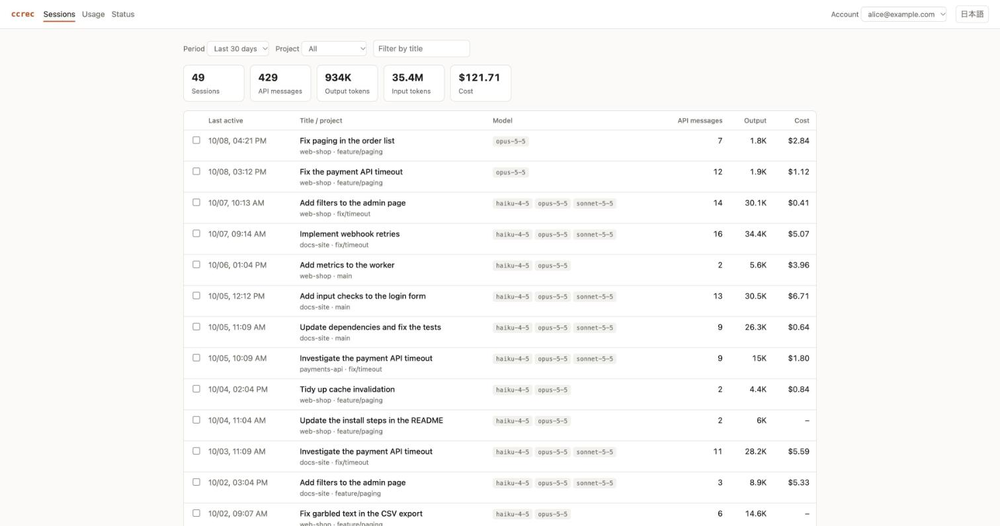
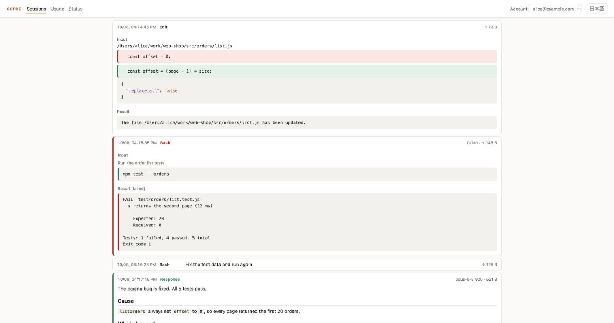
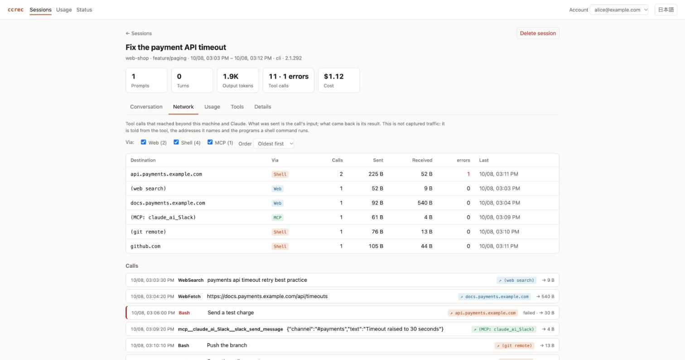
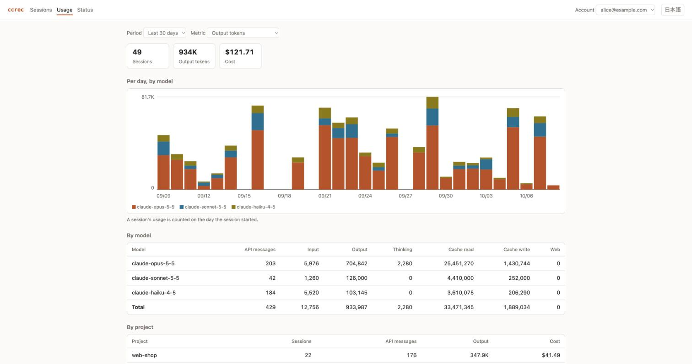
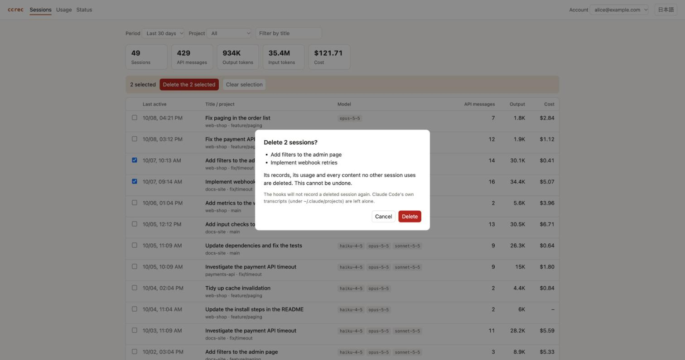

# Manual

English | [日本語](manual.ja.md)

How to install `ccrec`, use it day to day, look at the recordings in a browser, delete them, and what to do when something goes wrong. What exactly is recorded, and how, is in the [reference](reference.md).

The screens and the command output shown here are from data made up for the purpose.

## Contents

1. [Getting ready](#1-getting-ready)
2. [Recording](#2-recording)
3. [Looking in a browser](#3-looking-in-a-browser)
4. [Looking from the command line](#4-looking-from-the-command-line)
5. [Deleting recordings](#5-deleting-recordings)
6. [Choosing what is not recorded](#6-choosing-what-is-not-recorded)
7. [Changing where it records](#7-changing-where-it-records)
8. [Updating and removing](#8-updating-and-removing)
9. [When something goes wrong](#9-when-something-goes-wrong)
10. [Commands and files](#10-commands-and-files)

## 1. Getting ready

### What you need

| What | Version | How to check |
|---|---|---|
| Node.js | 18 or later | `node --version` |
| Java (a runtime) | 17 or later | `java -version` |
| Claude Code | a version with hooks | `claude --version` |

Java only has to run. The package carries the built engine, so neither a JDK nor a build tool is needed.

### Installing

Get the package (`.tgz`) from the GitHub release and install it with `npm install`.

```bash
gh release download --repo wfukatsu/claude-code-recorder --pattern '*.tgz'
npm install -g ./claude-code-recorder-1.1.0.tgz
ccrec version
```

When `ccrec version` prints a version, it is installed.

It can also be installed straight from the repository. The engine is then built during the install, which needs JDK 17 or later and a network connection to fetch its dependencies.

```bash
npm install -g github:wfukatsu/claude-code-recorder
```

### First setup

```bash
ccrec init            # create ~/.ccrec, set up to record into SQLite
ccrec install-hooks   # add the recording hooks to Claude Code
ccrec doctor          # check that everything is in place
```

`ccrec install-hooks` adds four hooks to `~/.claude/settings.json` and touches nothing else in it. The file as it was is kept, the first time only, as `~/.claude/settings.json.ccrec-bak`.

To record in one project only, run `ccrec install-hooks --project` in that project's directory. The hooks then go into `./.claude/settings.json`.

### Checking that it works

When every line of `ccrec doctor` says `ok`, you are ready.

```
ok    Java 17 or later  (found 17)
ok    engine JAR  (…/claude-code-recorder/lib/ccrec-engine.jar)
ok    ScalarDB configuration  (/Users/alice/.ccrec/database.properties)
ok    hooks installed  (/Users/alice/.claude/settings.json)
ok    queued sessions recorded  (none waiting)
ok    queue entries readable  (0 unreadable in /Users/alice/.ccrec/spool)
account  emp-alice  via env
```

The last line says which account recordings are filed under. For a line that says `FAIL`, see [When something goes wrong](#9-when-something-goes-wrong).

## 2. Recording

### Recording as you go

Once the hooks are installed, recording needs nothing from you. Each time Claude Code finishes a response, what is new since the last time goes into the database.

- All a hook does is leave a request in a queue. Another process writes to the database, so Claude Code is not kept waiting.
- When a recording did not happen — the laptop was closed, Java could not be found — it is made up for the next time Claude Code responds.
- A Claude Code session already running picks the hooks up from its next response.

### Bringing in what happened before

What happened before the hooks were installed can be recorded from the transcripts Claude Code keeps.

```bash
ccrec import ~/.claude/projects/<project directory>/
ccrec import ~/.claude/projects/<project directory>/<session id>.jsonl
```

- Given a directory, it records every `*.jsonl` in it.
- Running it again records nothing twice: lines already recorded are skipped.
- What it records is filed under the account of whoever runs it. A session that already has records stays with the account that first recorded it.

### Which account it is filed under

```bash
ccrec whoami
```

The account is decided in this order:

1. the environment variable `CCREC_ACCOUNT_ID` (an employee id handed out by an administrator, say)
2. the account Claude Code is logged in with
3. the operating system's user name (`local-<user>`)

## 3. Looking in a browser

### Starting and stopping

```bash
ccrec ui
```

A server starts and a browser opens. If none opens, open the address printed on the terminal.

```
ccrec ui: http://127.0.0.1:4127/?token=…
Ctrl-C stops it.
```

- To stop it, press Ctrl-C in the terminal it was started from.
- The `token=…` in the address is a password that changes at every start. Do not hand the address to anyone.
- It listens on this machine (`127.0.0.1`) only. Nothing else on the network can see it.
- `ccrec ui --port 4200` uses another port. `--no-open` prints the address without opening a browser.

### What every screen has

Across the top:

- **Sessions / Usage / Status** switch between the screens.
- **Account** switches between the accounts that have recordings in the database. It starts on the account of whoever started it.
- **日本語 / English** switches the language.

The browser remembers the language, the account, the period and the order you chose.

### Sessions



The screen it opens on. The session that was active most recently is at the top.

- **Filters**: the period (the last 7, 30 or 90 days, or all time), the project, and part of the title.
- **Totals**: the number of sessions shown, their API messages, output and input tokens, and cost.
- **Columns**: when it was last active, its title and project (and branch), the models it used, API messages, output tokens, cost.
- **Opening one**: click a title to go to that session.

The cost is what Claude Code itself wrote down for the session. A session it wrote none for shows "–".

### A session


From the top: the title, the project and the times, the main figures (prompts, turns and their duration, output tokens, tool calls and errors, pull requests, cost), and five tabs.

#### The Conversation tab

One row per record.

- **Order**: newest first to begin with, so that the latest of a long session is right there. To read it as a conversation from the top, set "Order" to "Oldest first".
- **What is shown**: checkboxes bring prompts, responses, tools, thinking, context and system records in and out. The numbers in parentheses are counts. Prompts, responses and tools are shown to begin with.
- **Agent**: in a session that used sub-agents, narrow it to one of them.
- **Load more**: up to 500 records are shown at a time; the button at the bottom loads the next ones.

Prompts and responses are open from the start.

- Markdown — headings, lists, tables, code — is laid out.
- A long text is held to about a screenful. "Show all" opens it.
- "As recorded" switches to the characters as they were stored.

The colour at the left of a row and its label say what it is.

| Label | What it is | How it looks |
|---|---|---|
| Prompt | A prompt somebody typed | An orange line at the left |
| Response | Claude's response | A green line at the left |
| Command | A slash command being run | A blue line at the left |
| Notice | A notification, of a background task for instance | A grey background |
| Command output | What a command printed | A grey background |
| Summary after compaction | The summary Claude Code writes when it compacts a conversation | A grey background; closed to begin with |

A tool's row opens when clicked.



- Closed, it shows the tool, the gist of the call (Bash's description, a file tool's path) and the size of what came back.
- `Bash` shows its description and command, and the result below.
- `Edit` and `Write` show the file's path, what was removed (red) and what was added (green).
- A call that failed has a red line at the left, and its result says "failed".

In the conversation, a tool call that reached beyond this machine and Claude carries a tag at the right of its row: "↗" and where it went.

#### The Network tab



The tool calls that reached beyond this machine and Claude, gathered in one place: what was sent where, and what came back.

- **The table of destinations**: for each, the way out, the number of calls, how much was sent and received, how many failed, and when it was last called.
- **Filtering by way out**: the checkboxes at the top bring Web, Shell and MCP in and out.
- **Filtering by destination**: click a destination in the table to keep only the calls to it. Click it again to go back.
- **The calls**: listed below. Open a row to see what was sent (the input) and what came back (the result).

There are three ways out.

| Way out | What it covers | How the destination is shown |
|---|---|---|
| Web | `WebFetch`, `WebSearch` and other tools that take an address | The address's host name; a search is `(web search)` |
| Shell | Programs run from `Bash` that talk to the network (`curl`, `wget`, `git push`, `gh`, `npm install`, `ssh` and so on) | The host name in the command; without one, the kind of place, such as `(git remote)` or `(npm registry)` |
| MCP | An MCP server's tools | The host name of an address in the input; without one, `(MCP: server name)` |

These are not counted:

- `localhost`, `127.0.0.1`, private addresses (`10.x`, `192.168.x` and the like), host names without a dot
- Claude itself (`anthropic.com`, `claude.ai`, `claude.com`)
- MCP servers that run on this machine (browser automation, for instance) — unless the input has an outside address

**This is not a capture of the traffic.** It is worked out from the tool's name, the addresses and the contents of the command. So:

- What a script does on its own (`python3 script.py` or `node app.js` opening a connection inside) is not seen.
- A program that talks to the network is counted even when, that time, it did not.
- An address in a file written by a here-document, or in a commit message, is not counted.
- Whether an MCP server stays on this machine cannot be told from its name. The common ones are treated as local from the start. For any other that is local, write its name under `localMcpServers` in `~/.ccrec/config.json` to leave it out.

```json
{ "recordThinking": true, "redact": true, "localMcpServers": ["my-local-server"] }
```

#### The Usage tab

API messages and tokens per model: input, output, thinking, cache read and cache write, and web searches and fetches. Thinking is part of output.

#### The Tools tab

Calls and errors per tool. MCP tools appear as `mcp__<server>__<tool>`.

#### The Details tab

What is known about the session: the entrypoint, Claude Code's version, time spent in the API and in tools, lines changed, where the prompts came from, stop reasons, permission modes, the skills and MCP servers used, pull requests opened, and so on.

### Usage



An account's usage over a period.

- **Period and metric**: the selectors at the top choose the period (the last 7, 30 or 90 days) and what is measured (output tokens, input tokens, API messages).
- **The chart**: one bar a day, stacked by model in different colours. Hover over a segment for its day, model and value.
- **By model, by project**: totals over the same period, as tables. The projects also show cost.

A session's usage is counted on the day the session started. A session that ran past midnight is counted whole on its first day.

### Status

Whether recording is working. It is `ccrec doctor` in a browser.

- **Checks**: whether the hooks are installed, whether any session is waiting to be recorded, whether any queue entry is unreadable — each `ok` or `FAIL`.
- **Environment**: the version, where the data is, where it records, the settings. The database password is not shown.
- **Sessions the hooks hold**: for each open session, the last event, when an ingest was asked for, when it was last ingested, and its state.
- **Ingest log**: the last 60 lines of when ingests were started and what they did.

"Refresh" reads it again.

### Deleting from the browser



- **One session**: "Delete session" at the top right of the session's page.
- **Several**: tick the checkboxes at the left of the rows in the list, then "Delete the n selected" in the bar that appears. Up to 50 at a time.

Either way a confirmation appears. "Delete" deletes. **It cannot be undone.** What goes is the same as in [Deleting recordings](#5-deleting-recordings).

When a filter hides a row, its tick is dropped. A session you cannot see is never deleted.

## 4. Looking from the command line

### Sessions

```bash
ccrec sessions                  # your sessions, newest first, 30 of them
ccrec sessions --limit 100
ccrec sessions --account emp-bob
ccrec sessions --day 20261007   # the organization's sessions that started that day
```

```
2026-10-08 16:13  a1a1a1a1-0000-4000-8000-999999999999  emp-alice  claude-opus-5-5  Fix paging in the order list
2026-10-08 15:03  a1a1a1a1-0000-4000-8000-999999999998  emp-alice  claude-opus-5-5  Fix the payment API timeout
```

From the left: when it started, the session id, the account, the model it last used, the title. The other commands take this session id. The day given to `--day` is in UTC.

### What was said and done

```bash
ccrec show <session-id>                          # the beginning of each record
ccrec show <session-id> --kind user_prompt,assistant_text
ccrec show <session-id> --full                   # all of each text
ccrec show <session-id> --json
```

```
--- [main] user_prompt  line 2.0  2026-10-08 16:13  218 bytes
Paging in the order list is broken: every page after the first shows the same orders. Please fix it.
--- [main] tool_use Read  line 3.0  2026-10-08 16:13  61 bytes  claude-opus-5-5  in=24 out=160 cache read=48000 write=1500
```

The kinds `--kind` takes include `user_prompt`, `assistant_text`, `thinking`, `tool_use`, `tool_result`, `system_prompt`, `tool_definitions`, `context`, `system`, `cost`, `pr_link` and `mcp_meta`.

### A session, summed up

```bash
ccrec summary <session-id>
ccrec summary <session-id> --json
```

```
title                 Fix paging in the order list
cost usd              $2.84 (as Claude Code last wrote it down)
api duration          3m06s
lines added           38
prompts               2
turns                 2
turn duration         4m13s
stop reasons          end_turn 2, tool_use 5
pull requests         https://github.com/example/web-shop/pull/128

tool   calls  errors
Bash       3       1
Edit       1       0
Read       1       0
```

(Some lines are left out here.) A table of usage per model follows.

### Usage

```bash
ccrec usage                     # the total of your 30 latest sessions
ccrec usage <session-id>...     # those sessions
ccrec usage --day 20261007      # the organization's sessions of that day
ccrec usage --json
```

```
account    model              messages        input       output     thinking     cache read    cache write    web
emp-alice  claude-haiku-4-5         14          420        6,834            0        239,190         13,668      0
emp-alice  claude-opus-5-5          33          876       54,967        2,280      2,705,645        130,994      0
emp-alice  claude-sonnet-5-5         4          120       12,000            0        420,000         24,000      0
total      5 sessions               51        1,416       73,801        2,280      3,364,835        168,662      0
```

`messages` is the number of API messages; `web` is web searches and fetches together.

## 5. Deleting recordings

### Deleting sessions by id

```bash
ccrec delete <session-id>...
```

### Deleting old ones together

```bash
ccrec delete --older-than 90d --dry-run   # only lists them; deletes nothing
ccrec delete --older-than 90d             # sessions with no activity for 90 days or more
ccrec delete --before 2026-07-01          # sessions whose activity stopped before that day began
```

```
2026-09-09 16:14  a1a1a1a1-0000-4000-8000-000000000046  Rework the order of search results
2026-09-09 10:09  a1a1a1a1-0000-4000-8000-000000000047  Fix garbled text in the CSV export
10 sessions of emp-alice last active before 2026-09-13 17:02; nothing deleted
```

Look at what `--dry-run` lists first, then run it without. It covers your own account; `--account <id>` changes that.

### What goes and what stays

| | |
|---|---|
| Goes | The session's row, its records, its usage, how far its files were read, and every content no other session uses |
| Stays | Content other sessions also use (a system prompt they share, for instance) |
| Stays | Claude Code's own transcripts (under `~/.claude/projects`) |

- **It cannot be undone.** No confirmation is asked on the command line, so check the session ids and the date.
- A session deleted by its id is not recorded by the hooks again. Importing it explicitly with `ccrec import` records it afresh from the start.
- The SQLite file does not shrink. The space freed is used again by later recordings. To remove the traces from the file as well, run `sqlite3 ~/.ccrec/ccrec.sqlite3 VACUUM`.
- Nothing deletes on a schedule. If you want that, run `ccrec delete --older-than 90d` from cron or the like.

## 6. Choosing what is not recorded

| To | Do this |
|---|---|
| Record nothing for a while | Start Claude Code with the environment variable `CCREC_DISABLE=1` |
| Leave a project out | Put an empty file named `.ccrec-ignore` at the top of the project |
| Leave thinking out | Set `"recordThinking": false` in `~/.ccrec/config.json` |
| Leave some kinds of record out | List them under `"exclude"` in `~/.ccrec/config.json` |

`.ccrec-ignore` applies wherever you work below the directory that holds it. A session it applied to once is not recorded to its end, even after it moves to another directory.

An example of `exclude`, leaving out what other hooks print. Where many hooks are installed, that can be close to half of all records.

```json
{ "recordThinking": true, "redact": true, "exclude": ["context/hook_success"] }
```

Settings take effect from the next recording. What is already recorded is not removed.

### Masking credentials

Before anything is stored, strings shaped like credentials are replaced with `[REDACTED]`: the tokens of major services, JWTs, private keys, a password inside a URL, the value of an `Authorization` header, an assignment such as `DB_PASSWORD=…`.

It prefers leaving something in over masking by mistake, so credentials of other shapes remain. **Treat the recordings as something that can contain source code and credentials the masking missed.** `~/.ccrec` is created readable and writable by its owner only.

## 7. Changing where it records

As first set up, it records into `~/.ccrec/ccrec.sqlite3` (SQLite). Rewriting `~/.ccrec/database.properties` changes that.

```properties
scalar.db.storage=jdbc
scalar.db.contact_points=jdbc:postgresql://db.example.com:5432/ccrec
scalar.db.username=ccrec
scalar.db.password=********
scalar.db.transaction_manager=consensus-commit
```

- The package works with SQLite, PostgreSQL and MariaDB.
- For other databases, see the [reference](reference.md#changing-the-database).
- Changing where it records does not move what was recorded before.

To change where the data lives altogether, set the environment variable `CCREC_HOME` (`~/.ccrec` by default).

## 8. Updating and removing

### Updating to a new version

Install the new package the same way.

```bash
npm install -g ./claude-code-recorder-<new version>.tgz
ccrec doctor
```

- The hooks and what is recorded carry over as they are.
- When the database has gained columns or tables, they are added the first time it runs.
- If `ccrec ui` is running, stop it and start it again.
- When a new version records more, what was recorded before does not gain it. To get it, delete the session and bring it in again with `ccrec import`.

### Stopping recording

```bash
ccrec uninstall-hooks   # remove the hooks; other settings stay
```

What is recorded stays after the hooks are removed, and `ccrec ui` and `ccrec sessions` still show it.

### Removing it completely

```bash
ccrec uninstall-hooks
npm uninstall -g claude-code-recorder
rm -rf ~/.ccrec          # deletes everything that was recorded
```

## 9. When something goes wrong

Run `ccrec doctor` first. For each line that says `FAIL`:

| The line | Why | What to do |
|---|---|---|
| `Java 17 or later` | Java is missing or too old | Install Java 17 or later. To use a Java somewhere else, set the environment variable `CCREC_JAVA` to the path of `java` |
| `engine JAR` | The engine is not there | Install the package again |
| `ScalarDB configuration` | The first setup was not done | Run `ccrec init` |
| `hooks installed` | The hooks are not installed | Run `ccrec install-hooks` |
| `queued sessions recorded` | A session has gone unrecorded for more than 10 minutes | Run `ccrec ingest`. If that does not help, look at the lines of `ingest.log` it prints |
| `queue entries readable` | A queue entry is broken | Look at `~/.ccrec/spool/*.json.bad`, and delete what is not needed |

### Common symptoms

**Nothing is recorded.**

- Check that `ccrec doctor` says `ok` for `hooks installed`.
- Check that there is no `.ccrec-ignore` in the project or above it, and that `CCREC_DISABLE=1` is not set.
- `~/.ccrec/logs/ingest.log` has when ingests were started and what they did. `~/.ccrec/logs/hook.err` has the hooks' errors.

**Recording stopped after Node.js was changed.**

The hooks remember where Node.js was when they were installed. After changing its version with nvm or the like, install `ccrec` again and run `ccrec install-hooks` once more.

**`ccrec ui` says "port 4127 is in use".**

`ccrec ui` is already running, or another program has that port. Stop the one that is running, or give another port: `ccrec ui --port 4200`.

**The browser says "Open the address that "ccrec ui" printed".**

The address you opened has no token. After `ccrec ui` is started again, the earlier address no longer works. Open the new one printed on the terminal.

**Deleting from the browser says "Another ccrec process is writing".**

A recording is running at that moment. Wait a few seconds and delete again.

**Usage or cost is empty.**

- The cost appears only when Claude Code wrote one down for the session. It does not for every session.
- A session recorded by an older version lacks what was added later. Delete it and bring it in again with `ccrec import` to get it.

## 10. Commands and files

### Commands

| Command | What it does |
|---|---|
| `ccrec init` | Creates `~/.ccrec` with a configuration for SQLite |
| `ccrec install-hooks [--project \| --settings <file>]` | Adds the recording hooks |
| `ccrec uninstall-hooks [--project \| --settings <file>]` | Removes them |
| `ccrec doctor` | Checks that everything is in place |
| `ccrec whoami` | Shows the account recordings are filed under |
| `ccrec import <file\|dir>...` | Records transcripts |
| `ccrec ingest` | Records what is left in the queue (normally automatic) |
| `ccrec ui [--port <n>] [--no-open]` | Opens the browser UI |
| `ccrec sessions [--limit <n>] [--account <id>] [--day <yyyymmdd> [--org <id>]] [--json]` | Lists sessions |
| `ccrec show <session-id> [--full] [--kind <kind,…>] [--json]` | Shows what was said and done |
| `ccrec summary <session-id> [--json]` | Sums a session up |
| `ccrec usage [<session-id>...] [--json]` | Usage per model |
| `ccrec delete <session-id>...` | Deletes sessions |
| `ccrec delete --before <yyyy-mm-dd> \| --older-than <n>d [--dry-run] [--account <id>]` | Deletes old sessions together |
| `ccrec version` | Prints the version |
| `ccrec help` | Describes the commands |

### Environment variables

| Variable | Meaning |
|---|---|
| `CCREC_HOME` | Where the data lives (`~/.ccrec` by default) |
| `CCREC_ACCOUNT_ID` | The id of the account recordings are filed under. `CCREC_ACCOUNT_EMAIL`, `CCREC_ACCOUNT_NAME`, `CCREC_ORG_ID` and `CCREC_ORG_NAME` can be given too |
| `CCREC_DISABLE=1` | Record nothing |
| `CCREC_JAVA` | The `java` to use (by default `JAVA_HOME`, then `PATH`) |

### Files

| Where | What |
|---|---|
| `~/.ccrec/ccrec.sqlite3` | What was recorded (with SQLite) |
| `~/.ccrec/database.properties` | Where it records |
| `~/.ccrec/config.json` | The recording settings (`recordThinking`, `redact`, `exclude`, `localMcpServers`) |
| `~/.ccrec/spool/` | The requests the hooks leave, and their state |
| `~/.ccrec/logs/ingest.log` | When ingests were started and what they did |
| `~/.ccrec/logs/hook.err` | The hooks' errors |
| `~/.ccrec/drivers/` | Where further JDBC drivers go |
| `~/.claude/settings.json` | Claude Code's settings; the hooks go here |
| `~/.claude/settings.json.ccrec-bak` | The settings as they were before the hooks |
